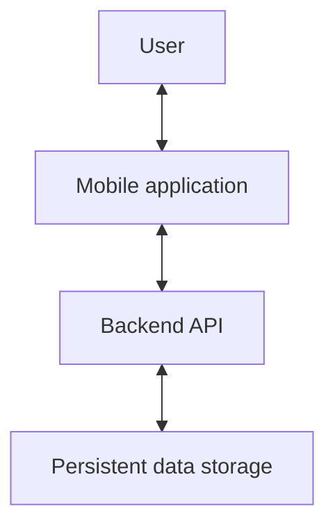
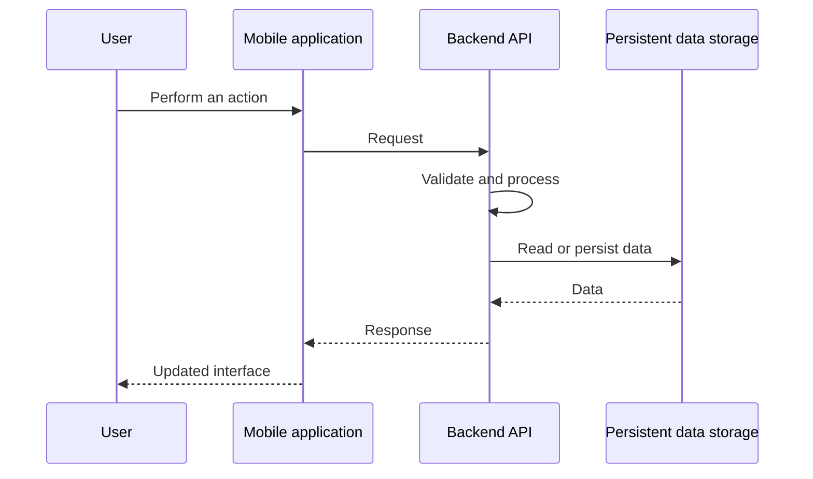

# ASCEND Architecture

## Status

This is a preliminary architecture document. It records the currently established application components and intended responsibilities, but it does not finalize API, authentication, state-management, or deployment decisions. Those decisions will be made after the product requirements are finalized and recorded in [Technical Decisions](decisions.md).

## Overview

ASCEND is a full-stack mobile application with a separation between the mobile client, backend API, and persistent data storage. This separation is intended to keep responsibilities clear and allow the application to evolve as new features are introduced.

## Architectural Goals

The architecture should prioritize:

- Separation of concerns
- Maintainability
- Scalability
- Security
- Testability
- Clear communication between application layers
- Efficient handling of workout data
- Future support for additional features and integrations

## Current Components

### Mobile Application

The `mobile/` directory contains a React Native application written in TypeScript. It is the primary user interface for ASCEND.

Its intended responsibilities include:

- User interface and navigation
- User interactions and local UI state
- Workout tracking, routine management, exercise browsing, progress visualization, and the rest timer
- Sending requests to the backend and displaying returned data

Business rules that belong to the backend should not be placed in the mobile application.

### Backend

The `backend/` directory contains a Node.js, Express, and TypeScript backend scaffold. It provides the API used by the mobile application.

Its intended responsibilities include:

- API operations
- Business logic
- Authentication and authorization
- Data validation
- Processing workout data, progression, and statistics
- Communication with persistent data storage
- Protecting user data

The backend is the application layer between the mobile client and persistent data storage.

### Persistent Data Storage

ASCEND will use PostgreSQL for persistent application data, including users, exercises, routines, workouts, sets, and progress data. The initial data model is documented in [Database](database.md); implementation details such as migrations and data access remain to be defined.

### Documentation

The `docs/` directory contains the product, requirements, roadmap, architecture, database, API, and technical-decision documentation.

## Communication and Data Flow

The mobile application will communicate with the backend through an API. The API contract is intentionally not defined in this document and will be documented in [API](api.md) once the requirements and architecture are finalized.

A typical operation follows this conceptual flow:

This pattern applies to operations such as creating routines, adding exercises, recording sets, completing workouts, retrieving workout history, and retrieving progression data.

## Separation of Responsibilities

| Component | Primary responsibilities |
| --- | --- |
| Mobile application | Presentation, user interaction, navigation, local UI state, and displaying application data |
| Backend | Business rules, authentication, authorization, validation, data processing, and API operations |
| Persistent data storage | Persistent data storage, data relationships, and data integrity |

These boundaries should prevent individual components from becoming tightly coupled.

## Workout Data and Progress

Workout tracking is central to ASCEND. The architecture should support recording workouts and sets independently of routines, while allowing routines to be used as reusable workout templates. Exact entities and relationships are deferred to [Database](database.md).

Progress information should be derived from recorded workout data. The backend may process data needed for volume, frequency, personal records, exercise progression, and other statistics before returning it to the mobile application for charts and statistics. The exact calculations and data structures will be defined during implementation and database design.

## Security Principles

The architecture should support the security requirements documented in [Requirements](requirements.md), including:

- Keeping sensitive credentials out of source code
- Managing secrets through environment variables or an appropriate secret-management system
- Secure authentication and protection of private resources
- Validation of incoming backend data
- Restricting users to resources they are authorized to access
- Never storing passwords in plain text
- Never including backend secrets in the mobile application

## Authentication and Authorization

ASCEND uses email-and-password authentication. The backend authenticates credentials and is the source of truth for the authenticated user. The mobile application must not make authorization decisions based only on local state.

### Authentication Flow

1. The mobile application sends a normalized email and password over HTTPS to the backend.
2. The backend creates or verifies the account credentials.
3. On successful authentication, the backend returns a short-lived access token and a refresh token.
4. The mobile application uses the access token for authenticated API requests.
5. When the access token expires, the application exchanges the refresh token for a rotated refresh token and a new access token.
6. On logout, the backend permanently deletes the corresponding session.

### Authorization

Protected backend operations must verify the access token and identify the authenticated user. Every query for private data must be scoped to that user. A valid token alone must never grant access to another user's routines, workouts, custom exercises, or training data.

## Scalability and Future Considerations

ASCEND should be able to add functionality without requiring a complete architectural rewrite. Future considerations include social features, advanced analytics, notifications, offline workout tracking, multi-device synchronization, health-platform integrations, and wearable integrations. These are not part of the initial architecture implementation.

## Decisions Still To Be Defined

The following decisions remain open:

- Authentication mechanism
- API structure and versioning strategy
- Mobile state management
- Local data persistence and offline synchronization strategy
- Backend module structure
- Validation and error-handling strategy
- Testing strategy
- Deployment architecture

When made, these decisions should be recorded in [Technical Decisions](decisions.md).
