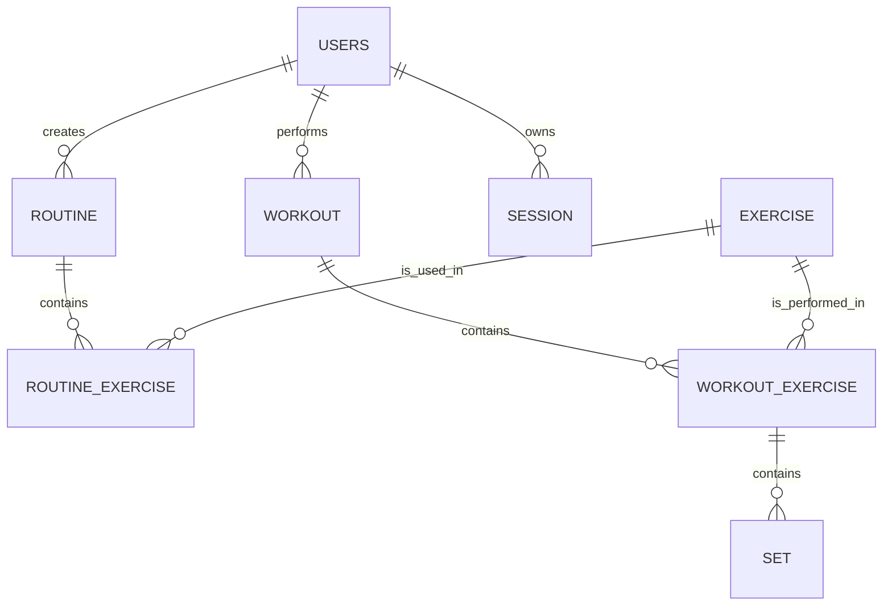

# Database

## Status

ASCEND will use PostgreSQL as its database. Prisma will be used as the ORM and migration tool. This document defines the initial logical data model, including columns, key relationships, core constraints, default values, and indexes. Prisma configuration and migrations remain to be defined.

## Initial Tables

The initial data model consists of the following tables:

| Table | Purpose |
| --- | --- |
| `users` | Stores application users. |
| `exercise` | Stores exercises available to the application. |
| `routine` | Stores reusable workout routines created by users. |
| `routine_exercise` | Associates exercises with routines. |
| `workout` | Stores workouts performed by users. |
| `workout_exercise` | Associates exercises with workouts. |
| `set` | Stores the sets recorded for a workout exercise. |
| `session` | Stores active refresh-token sessions for authenticated users. |

## Relationships

In relational terms:

- A user can have many routines.
- A user can have many workouts.
- A user can have many active sessions.
- A routine can contain many `routine_exercise` records.
- An exercise can appear in many `routine_exercise` records.
- A workout can contain many `workout_exercise` records.
- An exercise can appear in many `workout_exercise` records.
- A `workout_exercise` can contain many sets.

`routine_exercise` and `workout_exercise` are association tables. They represent the exercise entries within a routine and a performed workout, respectively.

## Data-Model Conventions

- Every primary key is a UUID v4, generated by PostgreSQL with `gen_random_uuid()`.
- References between tables use `uuid` foreign keys.
- Timestamps use `timestamptz` so recorded workout times retain their timezone context.
- `created_at` and `updated_at` are required on entities that users create or modify.
- Nullable columns represent information that is optional or only applicable in some cases.
- Records use permanent deletion; no soft-delete or audit-history fields are included.
- Every foreign-key relationship uses `ON DELETE CASCADE`, so deleting a parent record permanently deletes its dependent records.

## Default Values

| Table | Column | Default |
| --- | --- | --- |
| All tables | `id` | `gen_random_uuid()` |
| `users`, `exercise`, `routine`, `workout`, `workout_exercise`, `set`, `session` | `created_at` | `now()` |
| `users`, `exercise`, `routine`, `workout`, `workout_exercise`, `set`, `session` | `updated_at` | `now()` on creation; updated whenever the record changes. |
| `workout` | `status` | `active` |
| `workout` | `started_at` | `now()` |
| `set` | `set_type` | `normal` |
| `set` | `is_completed` | `false` |
| `exercise` | `target_muscle_groups` | An empty array (`[]`) |

`position`, `set_number`, target values, recorded performance values, and optional text fields have no default value. They must be supplied when applicable.

## Table Definitions

### `users`

| Column | PostgreSQL type | Required | Description |
| --- | --- | --- | --- |
| `id` | `uuid` | Yes | Primary key. |
| `email` | `varchar(255)` | Yes | User email address; stored normalized in lowercase and unique. |
| `password_hash` | `text` | Yes | Hashed password. Plain-text passwords must never be stored. |
| `created_at` | `timestamptz` | Yes | Account creation time. |
| `updated_at` | `timestamptz` | Yes | Most recent account update time. |

Constraints:

- `id` is the primary key.
- `email` is unique.

### `exercise`

| Column | PostgreSQL type | Required | Description |
| --- | --- | --- | --- |
| `id` | `uuid` | Yes | Primary key. |
| `name` | `varchar(255)` | Yes | Exercise name. |
| `description` | `text` | No | Exercise description. |
| `target_muscle_groups` | `text[]` | Yes | One or more target muscle groups; defaults to an empty array. |
| `equipment` | `varchar(255)` | No | Equipment used for the exercise. |
| `instructions` | `text` | No | Exercise instructions. |
| `media_url` | `text` | No | Media or demonstration reference. |
| `created_by_user_id` | `uuid` | No | References `users.id` for a custom exercise. A null value represents an application-provided exercise. |
| `created_at` | `timestamptz` | Yes | Exercise creation time. |
| `updated_at` | `timestamptz` | Yes | Most recent exercise update time. |

Constraints:

- `id` is the primary key.
- `created_by_user_id` references `users.id` with `ON DELETE CASCADE`.

### `routine`

| Column | PostgreSQL type | Required | Description |
| --- | --- | --- | --- |
| `id` | `uuid` | Yes | Primary key. |
| `user_id` | `uuid` | Yes | References `users.id`; the owner of the routine. |
| `name` | `varchar(255)` | Yes | Routine name. |
| `created_at` | `timestamptz` | Yes | Routine creation time. |
| `updated_at` | `timestamptz` | Yes | Most recent routine update time. |

Constraints:

- `id` is the primary key.
- `user_id` references `users.id` with `ON DELETE CASCADE`.

### `routine_exercise`

| Column | PostgreSQL type | Required | Description |
| --- | --- | --- | --- |
| `id` | `uuid` | Yes | Primary key. |
| `routine_id` | `uuid` | Yes | References `routine.id`. |
| `exercise_id` | `uuid` | Yes | References `exercise.id`. |
| `position` | `integer` | Yes | Exercise order within the routine. |
| `target_sets` | `smallint` | No | Target number of sets. |
| `target_repetitions_min` | `smallint` | No | Lower value of the target repetition range. |
| `target_repetitions_max` | `smallint` | No | Upper value of the target repetition range. |
| `target_weight` | `numeric(8,2)` | No | Target weight, when applicable. |
| `rest_seconds` | `integer` | No | Configured rest time. |
| `notes` | `text` | No | Notes for the exercise in this routine. |

Constraints:

- `id` is the primary key.
- `routine_id` references `routine.id` with `ON DELETE CASCADE`.
- `exercise_id` references `exercise.id` with `ON DELETE CASCADE`.
- The combination of `routine_id` and `position` is unique.
- When both repetition values are present, `target_repetitions_min` must not exceed `target_repetitions_max`.
- When present, `target_sets`, repetition values, `target_weight`, and `rest_seconds` cannot be negative.

### `workout`

| Column | PostgreSQL type | Required | Description |
| --- | --- | --- | --- |
| `id` | `uuid` | Yes | Primary key. |
| `user_id` | `uuid` | Yes | References `users.id`; the user performing the workout. |
| `routine_id` | `uuid` | No | References `routine.id` when the workout was started from a routine. |
| `status` | `varchar(20)` | Yes | Workout state: `active`, `paused`, `completed`, or `cancelled`. |
| `started_at` | `timestamptz` | Yes | Workout start time. |
| `completed_at` | `timestamptz` | No | Workout completion time. |
| `created_at` | `timestamptz` | Yes | Workout record creation time. |
| `updated_at` | `timestamptz` | Yes | Most recent workout update time. |

Constraints:

- `id` is the primary key.
- `user_id` references `users.id` with `ON DELETE CASCADE`.
- `routine_id` references `routine.id` with `ON DELETE CASCADE` when present.
- `status` is limited to `active`, `paused`, `completed`, and `cancelled`.
- When `completed_at` is present, it must not precede `started_at`.

### `workout_exercise`

| Column | PostgreSQL type | Required | Description |
| --- | --- | --- | --- |
| `id` | `uuid` | Yes | Primary key. |
| `workout_id` | `uuid` | Yes | References `workout.id`. |
| `exercise_id` | `uuid` | Yes | References `exercise.id`. |
| `position` | `integer` | Yes | Exercise order within the workout. |
| `created_at` | `timestamptz` | Yes | Workout exercise creation time. |
| `updated_at` | `timestamptz` | Yes | Most recent workout exercise update time. |

Constraints:

- `id` is the primary key.
- `workout_id` references `workout.id` with `ON DELETE CASCADE`.
- `exercise_id` references `exercise.id` with `ON DELETE CASCADE`.
- The combination of `workout_id` and `position` is unique.

### `set`

| Column | PostgreSQL type | Required | Description |
| --- | --- | --- | --- |
| `id` | `uuid` | Yes | Primary key. |
| `workout_exercise_id` | `uuid` | Yes | References `workout_exercise.id`. |
| `set_number` | `smallint` | Yes | Set order within the workout exercise. |
| `weight` | `numeric(8,2)` | No | Recorded weight. |
| `repetitions` | `smallint` | No | Recorded repetitions. |
| `rpe` | `numeric(3,1)` | No | Recorded RPE. |
| `set_type` | `varchar(20)` | No | Set type: `normal`, `warm_up`, `drop_set`, or `failure`. |
| `notes` | `text` | No | Set notes. |
| `is_completed` | `boolean` | Yes | Completion status. |
| `completed_at` | `timestamptz` | No | Set completion time. |
| `created_at` | `timestamptz` | Yes | Set creation time. |
| `updated_at` | `timestamptz` | Yes | Most recent set update time. |

Constraints:

- `id` is the primary key.
- `workout_exercise_id` references `workout_exercise.id` with `ON DELETE CASCADE`.
- The combination of `workout_exercise_id` and `set_number` is unique.
- `set_number` must be greater than zero.
- When present, `weight` and `repetitions` cannot be negative.
- `set_type` is limited to `normal`, `warm_up`, `drop_set`, and `failure`.

### `session`

| Column | PostgreSQL type | Required | Description |
| --- | --- | --- | --- |
| `id` | `uuid` | Yes | Primary key and session identifier. |
| `user_id` | `uuid` | Yes | References `users.id`. |
| `refresh_token_hash` | `text` | Yes | Hash of the refresh token. The refresh token itself must never be stored. |
| `expires_at` | `timestamptz` | Yes | Refresh-token expiration time. |
| `created_at` | `timestamptz` | Yes | Session creation time. |
| `updated_at` | `timestamptz` | Yes | Most recent session update time. |

Constraints:

- `id` is the primary key.
- `user_id` references `users.id` with `ON DELETE CASCADE`.
- `refresh_token_hash` is unique.

## Index Strategy

The following indexes support the queries required by the current product scope. Primary keys and unique constraints create their own indexes.

| Table | Index | Purpose |
| --- | --- | --- |
| `users` | Unique index on `email` | Account lookup and duplicate-email prevention. |
| `exercise` | Index on `lower(name)` | Exercise search by name. |
| `exercise` | Index on `equipment` | Exercise filtering by equipment. |
| `exercise` | GIN index on `target_muscle_groups` | Exercise filtering by muscle group. |
| `exercise` | Index on `created_by_user_id` | Retrieval of a user's custom exercises. |
| `routine` | Index on `user_id` | Retrieval of a user's routines. |
| `routine_exercise` | Unique index on (`routine_id`, `position`) | Ordered retrieval of routine exercises. |
| `routine_exercise` | Index on `exercise_id` | Lookup of routines that use an exercise. |
| `workout` | Index on (`user_id`, `started_at` DESC) | Workout history for a user. |
| `workout` | Index on (`user_id`, `status`) | Retrieval of a user's active or paused workouts. |
| `workout` | Index on `routine_id` | Lookup of workouts started from a routine. |
| `workout_exercise` | Unique index on (`workout_id`, `position`) | Ordered retrieval of workout exercises. |
| `workout_exercise` | Index on `exercise_id` | Exercise history and progression queries. |
| `set` | Unique index on (`workout_exercise_id`, `set_number`) | Ordered retrieval of recorded sets. |
| `session` | Unique index on `refresh_token_hash` | Refresh-token lookup and one-time rotation. |
| `session` | Index on `user_id` | Session lookup and logout operations for a user. |
| `session` | Index on `expires_at` | Expired-session cleanup. |

The final index set should be reviewed against real query patterns once the API and data-access layer are implemented.

## Scope Not Yet Defined

The following implementation details remain intentionally undefined:

- Migration strategy
- Prisma configuration and migration implementation
- Whether additional validation constraints are needed for values such as RPE

These decisions should be documented in [Technical Decisions](decisions.md) when they are made.
